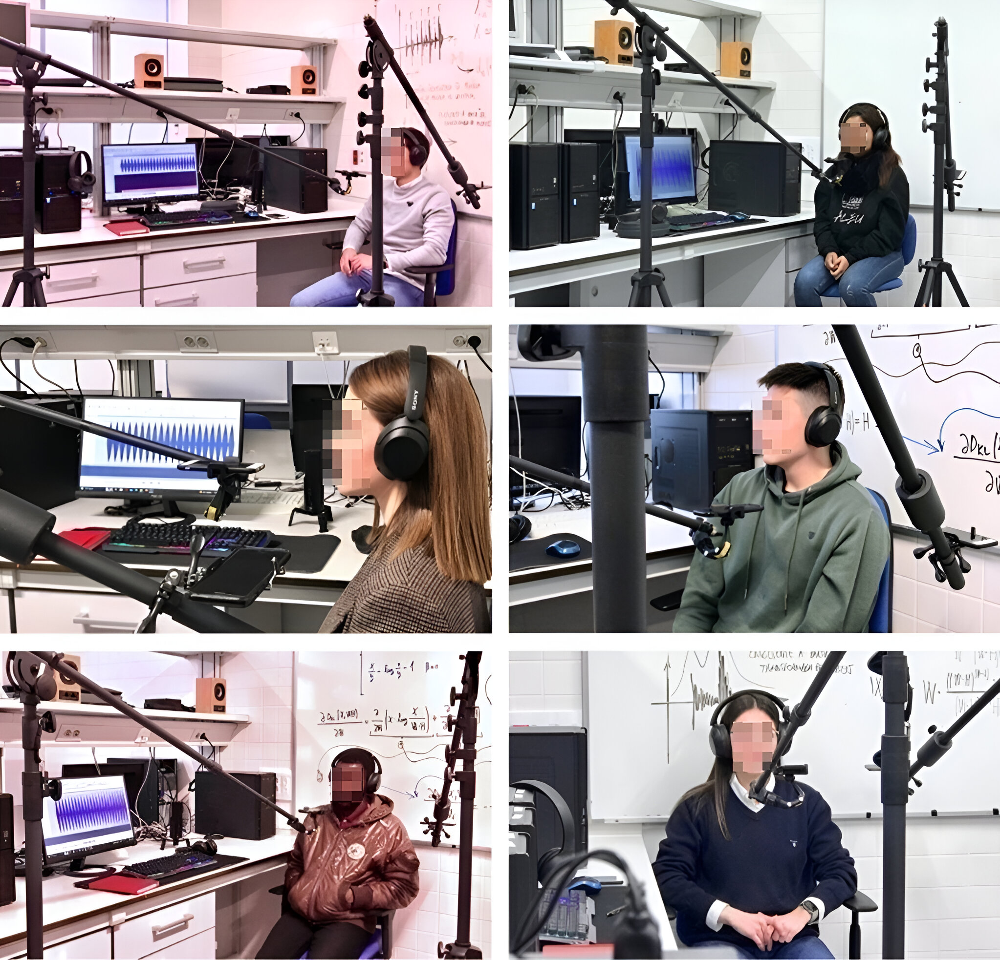

<!-- PROJECT LOGO -->
 

  

  <h3 align="center">BreathMY database</h3>

  

    An open-source audio database for respiratory rate (RR) estimation research
     
  

<!-- TABLE OF CONTENTS -->

  
Table of Contents

  <ol>
    <li>
      <a href="#about-the-database">About The Database</a>
    </li>
    <li><a href="#license">License</a></li>
    <li><a href="#contact">Contact</a></li>
    <li><a href="#citing">Citing</a></li>
    <li><a href="#acknowledgments">Acknowledgments</a></li>
  </ol>

<!-- ABOUT THE DATABASE -->

## About The Database

Respiratory rate is a well-known acoustic biomarker of the health status of the respiratory system.
In this repository, we offer a systematic and labelled database of auditory recordings of 30 (15 male, 15 female) subjects, aged between 18 and 60 years-old, breathing at five different respiratory rates (10, 12, 18, 20 and 24), organized by breaths per minute (bpm), captured with a conventional smartphone. As shown in Figure 1, during the recording sessions, subjects were positioned  upright facing
the smartphone at distances of 20 and 40 cm. Each recording takes 1 minute, and was registered at 8 kHz in mono.  
  

Figure 1: Some participants in the recording session at the research
laboratory at the Superior Polytechnic School of Linares.  

Using a pre-recording training process, each subject was trained by means of an audio-visual tool to ensure a uniform temporal rhythmic sequence, i.e. a constant RR during each 1-minute recording session. For each subject, 10 recordings were performed, varying the RR between 10, 12, 18, 20 and 24 breaths per minute (bpm), and changing the distance between the participant's mouth and the smartphone between 20 and 40 cm. 
 
 
Additionally, considering that real-world scenarios involve not only respiratory signals, the recorded signals were mixed with noise signals that may be present in hospitals or at home, ranging in signal-to-noise ratio (SNR) between 6, 0 and -6 dB.
 
 
The main objective of the BreathMY database is to provide a set of reliably labeled sound signals at different respiratory rates so that they can be used by researchers to evaluate different algorithms applied to respiratory rate estimation from the analysis of sound respiratory signals.
 
 
The BreathMY database comprises a total of 1200 recordings divided into four sets of sounds (300 recordings for each set) according to the following structure:
<ul>
  <li>D_A: original recordings without without any noise contamination</li>
  <ul>
  <li>Folder named '10RR': recordings at 10 bpm</li>
  <li>Folder named '12RR': recordings at 12 bpm</li>
  <li>Folder named '18RR': recordings at 18 bpm</li>
  <li>Folder named '20RR': recordings at 20 bpm</li>
  <li>Folder named '24RR': recordings at 24 bpm</li>
</ul> 
  <li>D_B: recordings mixed with noise (SNR=-6 dB)</li>
  <ul>
  <li>Folder named '10RR': recordings at 10 bpm</li>
  <li>Folder named '12RR': recordings at 12 bpm</li>
  <li>Folder named '18RR': recordings at 18 bpm</li>
  <li>Folder named '20RR': recordings at 20 bpm</li>
  <li>Folder named '24RR': recordings at 24 bpm</li>
</ul> 
    <li>D_C: recordings mixed with noise (SNR=0 dB)</li>
  <ul>
  <li>Folder named '10RR': recordings at 10 bpm</li>
  <li>Folder named '12RR': recordings at 12 bpm</li>
  <li>Folder named '18RR': recordings at 18 bpm</li>
  <li>Folder named '20RR': recordings at 20 bpm</li>
  <li>Folder named '24RR': recordings at 24 bpm</li>
</ul> 
    <li>D_D: recordings mixed with noise (SNR=6 dB)</li>
  <ul>
  <li>Folder named '10RR': recordings at 10 bpm</li>
  <li>Folder named '12RR': recordings at 12 bpm</li>
  <li>Folder named '18RR': recordings at 18 bpm</li>
  <li>Folder named '20RR': recordings at 20 bpm</li>
  <li>Folder named '24RR': recordings at 24 bpm</li>
</ul> 
</ul> 

Inside each set you will find 60 recordings, 2 for each subject, varying the distance between the subject's mouth and the smartphone between 20 and 40 cm.  
 
The format and the temporal signature of each audio file presents the following form:  
<RR value (two digits)>RR_<distance between the subject's mouth and the device (two digits)>cm_<year (four digits)>_<month (two digits)>_<day (two digits)>_<subject (letter)>
 
 

For example, for the audio file denoted as '18<strong>RR_</strong>20<strong>cm_</strong>2023<strong>_</strong>02<strong>_</strong>20<strong>_</strong>A' the data are as follows:

 <ul>
  <li>RR value (two digits): 18</li>
  <li>distance between the subject's mouth and the device (two digits): 20</li>
  <li>year (four digits): 2023</li>
  <li>month (two digits): 02</li>
  <li>day (two digits): 20</li>
  <li>subject (letter): A</li>
</ul> 
 
Note that the bold letters (RR and cm) and the '_' symbols remain fixed in the name of all audio files.

(<a href="#readme-top">back to top</a>)

<!-- LICENSE -->

## License

Distributed under the MIT License. See `LICENSE.txt` for more information.

(<a href="#readme-top">back to top</a>)

<!-- CONTACT -->

## Contact
Juan de la Torre Cruz (jtorre@ujaen.es)
 
Francisco Jesús Cañadas Quesada (fcanadas@ujaen.es)
 
Alejandro Antonio Salvador Navarro (aasn0001@red.ujaen.es)

(<a href="#readme-top">back to top</a>)

<!-- CITING -->

## Citing
When using this dataset please cite the following publication “Respiratory rate estimation applying non-negative matrix partial co-factorization from breath sounds” as the source.

(<a href="#readme-top">back to top</a>)

<!-- ACKNOWLEDGMENTS -->

## Acknowledgments

This work was supported in part under grant PID2020-119082RB-\{C21,C22\} funded by MCIN/AEI/10.13039/501100011033. Furthermore, the authors would like to thank to both the academic and local communities for their invaluable support throughout the execution of this study. Special appreciation is extended to the University of Jaen, with particular recognition of the Superior Polytechnic School of Linares, for their assistance in facilitating this research endeavor.

(<a href="#readme-top">back to top</a>)

